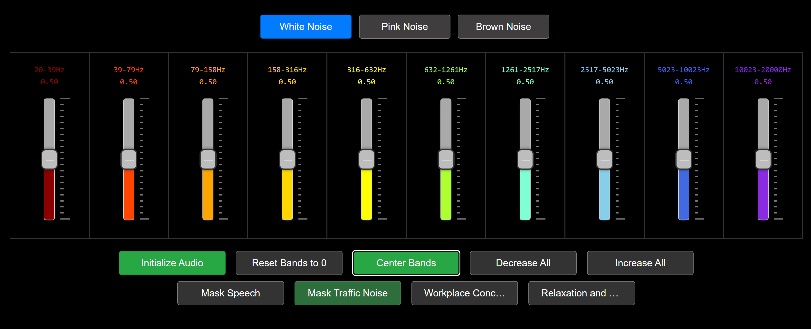
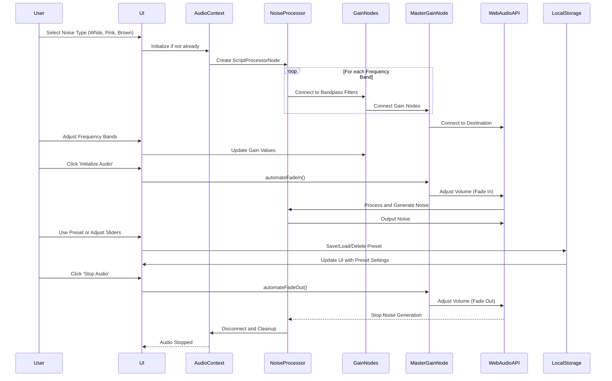

# White Noise Generator

[Noise Generator HTML File](https://mgantlett.github.io/sound_generator/noise_generator.html)

## Overview

The White Noise Generator is a versatile web application designed to produce white, pink, and brown noise. It utilizes the Web Audio API for advanced audio processing and is compatible with 7.1 surround sound systems. This application is user-friendly, with a focus on customizable audio experiences and seamless user interaction. Inspired by [mynoise.net](https://mynoise.net/NoiseMachines/whiteNoiseGenerator.php).

## Features

- Three types of noise generation: white, pink, and brown.
- Compatibility with 7.1 surround sound systems.
- Adjustable frequency bands for detailed sound customization.
- Smooth fade-in and fade-out effects for a pleasant audio experience.
- User-defined presets for specific needs such as speech masking, traffic noise reduction, workplace concentration, and relaxation.
- Ability to save, load, and delete custom settings for repeated use.
- Enhanced user control with the addition of a feature to save and manage personal presets.

## Usage Instructions

1. Launch the application in a web browser that supports the Web Audio API.
2. Choose your desired noise type (white, pink, or brown) using the radio buttons.
3. Customize the sound using the frequency band sliders.
4. Start the noise generation by clicking "Initialize Audio."
5. Utilize the preset buttons for specific scenarios or create your own custom settings.
6. Save your custom settings as presets for future use.
7. Load or delete saved presets as needed.
8. Stop the noise generation smoothly by clicking "Stop Audio."

## Technical Details

- Built with HTML, CSS, and JavaScript.
- Uses the Web Audio API for real-time audio processing.
- Features a script processor node for dynamic noise generation.
- Gain nodes for precise control of different frequency bands.
- NoUiSlider for interactive and responsive sliders.
- Local Storage for saving and retrieving user-defined presets.

### Core Functions

- `playNoise`: Starts noise generation based on selected type and settings.
- `setupGainNodes`: Configures gain nodes corresponding to frequency bands.
- `generateWhiteNoise`, `generatePinkNoise`, `generateBrownNoise`: Functions for different noise types.
- `stopNoise`: Fades out and stops noise generation.
- `toggleAudio`: Toggles the state of audio playback.
- `savePreset`, `loadPresetOptions`, `deletePreset`: Functions for managing user-defined presets.

### Interaction Flow of the White Noise Generator Application
 

## Browser Compatibility

Optimized for modern browsers like Chrome, Firefox, and Edge that fully support the Web Audio API.

## Contributing

Contributions to the White Noise Generator project are welcome. Follow standard procedures for contributing to open-source projects, including submitting pull requests for new features or bug fixes.

## License

[MIT License](LICENSE.md)

## Author

[Mark Gantlett]

## Assistance by ChatGPT

Throughout the development of the White Noise Generator, I received substantial assistance from ChatGPT, an AI developed by OpenAI. ChatGPT helped in various aspects including:

- Code troubleshooting and debugging.
- Generating sequence diagrams to visualize the application flow.
- Refactoring and commenting the JavaScript code for better readability and maintainability.
- Providing suggestions and guidance on implementing specific features such as the fade-in/fade-out functionality.
- Assisting in writing and structuring this `README.md` file.

The collaboration with ChatGPT showcases the potential of AI-assisted development in creating robust and efficient web applications.
