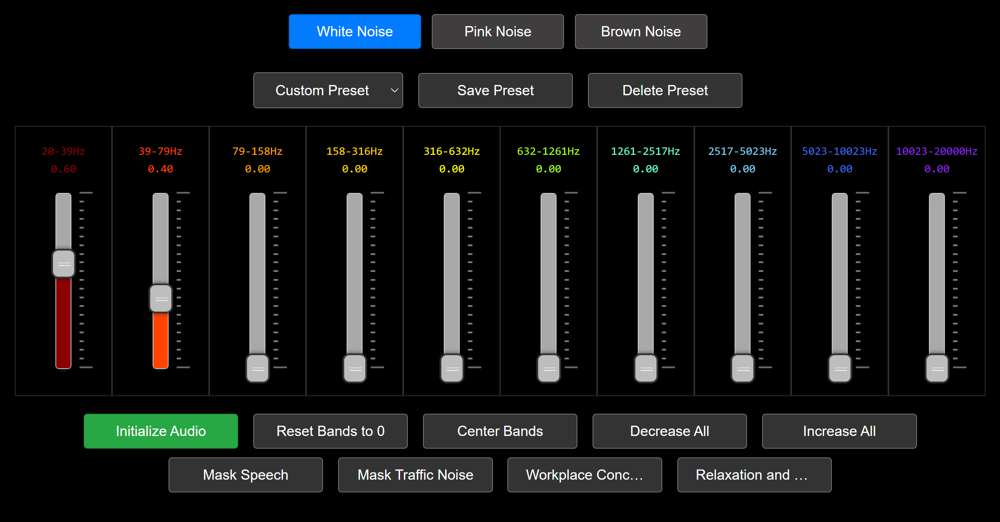

# White Noise Generator

## Overview
The White Noise Generator is a versatile web application designed to produce white, pink, and brown noise. It utilizes the Web Audio API for advanced audio processing and is compatible with 7.1 surround sound systems. This application is user-friendly, with a focus on customizable audio experiences and seamless user interaction.

## Features
- Three types of noise generation: white, pink, and brown.
- Compatibility with 7.1 surround sound systems.
- Adjustable frequency bands for detailed sound customization.
- Smooth fade-in and fade-out effects for a pleasant audio experience.
- User-defined presets for specific needs such as speech masking, traffic noise reduction, workplace concentration, and relaxation.
- Ability to save and load custom settings for repeated use.

## Usage Instructions
1. Launch the application in a web browser that supports the Web Audio API.
2. Choose your desired noise type (white, pink, or brown) using the radio buttons.
3. Customize the sound using the frequency band sliders.
4. Start the noise generation by clicking "Initialize Audio."
5. Utilize the preset buttons for specific scenarios or fine-tune your settings.
6. Stop the noise generation smoothly by clicking "Stop Audio."

## Technical Details
- Built with HTML, CSS, and JavaScript.
- Uses the Web Audio API for real-time audio processing.
- Features a script processor node for dynamic noise generation.
- Gain nodes for precise control of different frequency bands.
- NoUiSlider for interactive and responsive sliders.

### Core Functions
- `playNoise`: Starts noise generation based on selected type and settings.
- `setupGainNodes`: Configures gain nodes corresponding to frequency bands.
- `generateWhiteNoise`, `generatePinkNoise`, `generateBrownNoise`: Functions for different noise types.
- `stopNoise`: Fades out and stops noise generation.
- `toggleAudio`: Toggles the state of audio playback.

## Browser Compatibility
Optimized for modern browsers like Chrome, Firefox, and Edge that fully support the Web Audio API.
